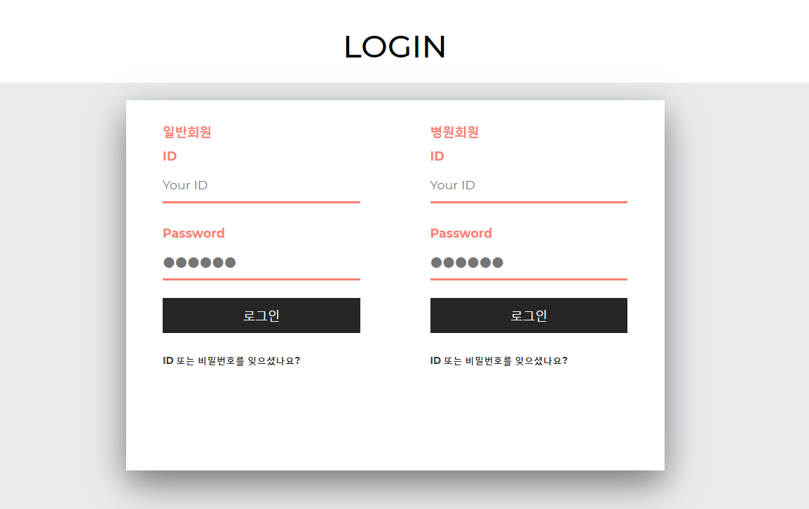
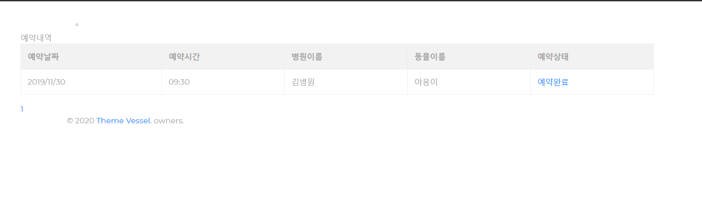

## PET CLINIC(반려동물 병원 예약 시스템)

### 팀원

- 한수정(hannncrystal)
- 임지영(jiyoung-lim-00)
- 김준우(junwoo1027)
- 김소희(beans3)
- 한성길(zaien24)
- 홍창용(ghd075)

### 개발환경
- JAVA, JSP, Spring, Mybatis, Jquery, Mysql, Bootstrap  
 
 
### 주요기능
1. 병원 검색 / 조회
2. 병원 예약 / 조회
3. FAQ 게시판
4. 회원 등록(개인, 병원)
5. 로그인(개인, 병원)
6. 반려동물 등록 / 관리
7. 동물병원리뷰 작성
8. 즐겨찾는 병원 등록/ 관리
9. 병원 마이페이지 예약자 조회

### 메인화면

### 로그인화면

### 반려동물등록

### 반려동물 목록

### FAQ

### 병원예약 화면

### 예약조회 화면

### 병원리뷰 화면

